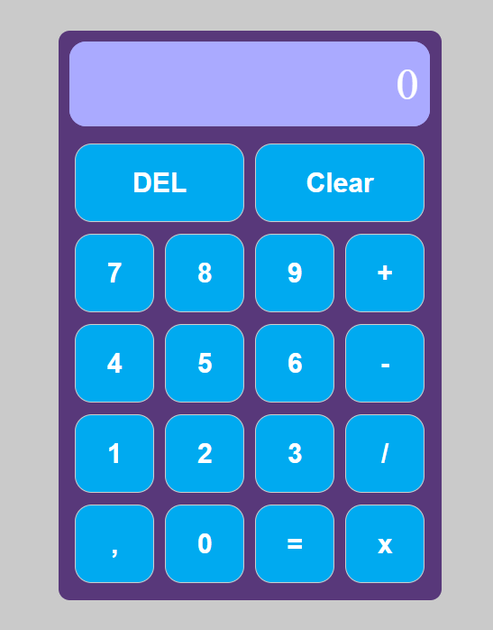

# Calculadora

Este é o projeto de uma calculadora com as quatro operações básicas da matemática: adição, subtração, multiplicação e divisão. Este projeto foi feito com a biblioteca React.

## Scripts disponíveis:

No diretório do projeto, você pode executar:

### `npm start`

Executa o aplicativo no modo de desenvolvimento.\
Abra [http://localhost:3000](http://localhost:3000) para visualizá-lo no seu navegador.

A página será recarregada quando você fizer alterações.\
Você também pode ver erros de lint no console.

### `npm run build`

Cria o aplicativo para produção na pasta `build`.\
Ele agrupa corretamente o React no modo de produção e otimiza a compilação para o melhor desempenho.

A compilação é minificada e os nomes dos arquivos incluem os hashes.\
Seu aplicativo está pronto para ser implantado!

Veja a seção sobre [implantação](https://facebook.github.io/create-react-app/docs/deployment) para mais informações.

### Design do projeto

